# Who is responsible for climate change?

Visualization of the *Carbon Dioxide* emissions from the world bank in order to understand the climate change.

---

## Charts

- Global emissions throught the years:

  - Global emissions every year:
  
    - total emissions every year:

        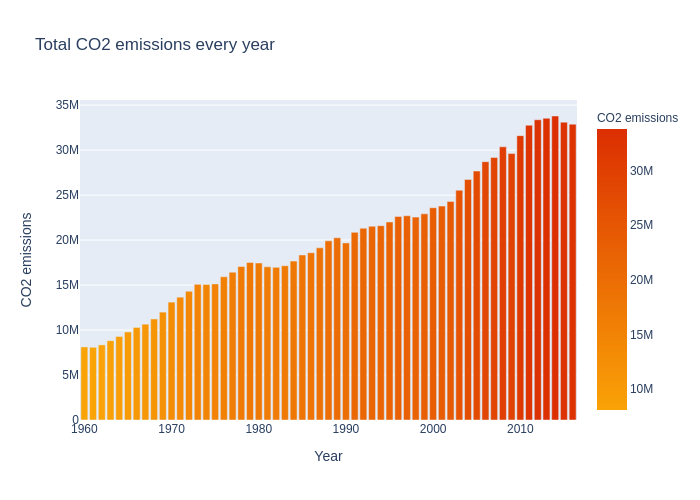

    - change in emissions every year:

        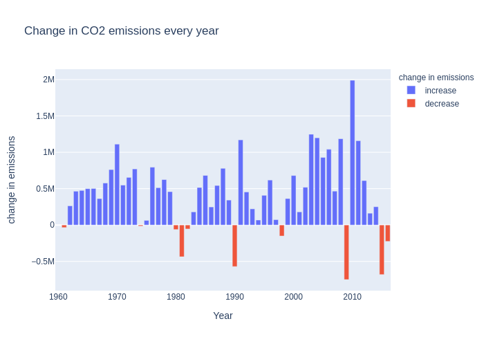

  - Global emissions every decade:

    - total emissions every decade:

        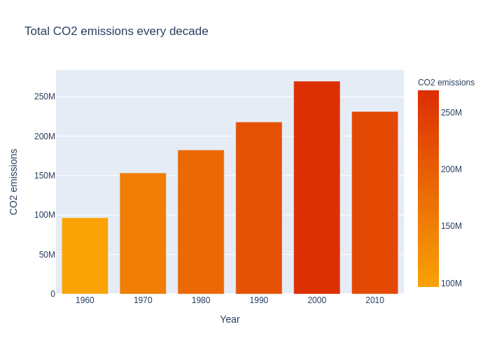

    - change in emissions every decade:

        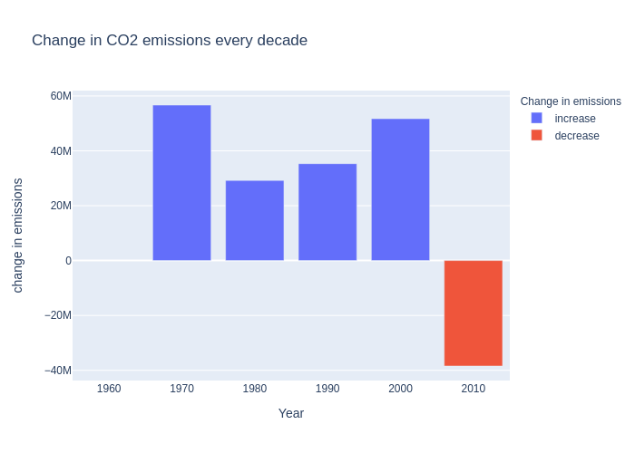

- Which countries emit the most carbon dioxide today:

    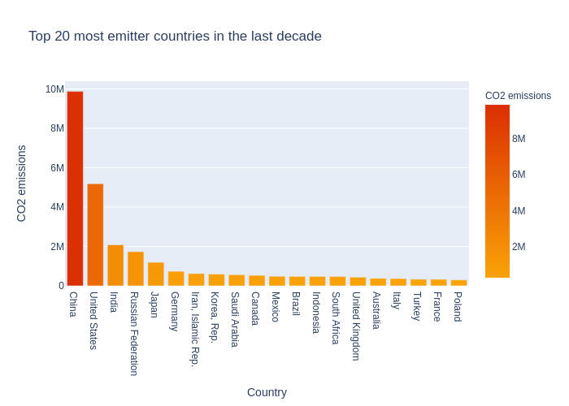

    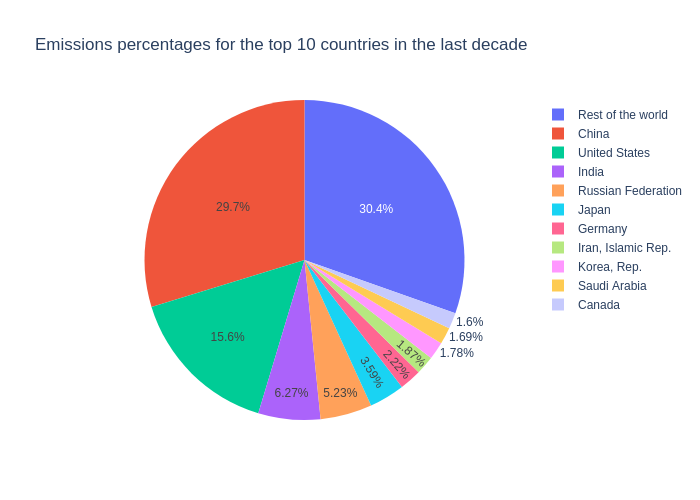

- Which countries emitted the most in total:

    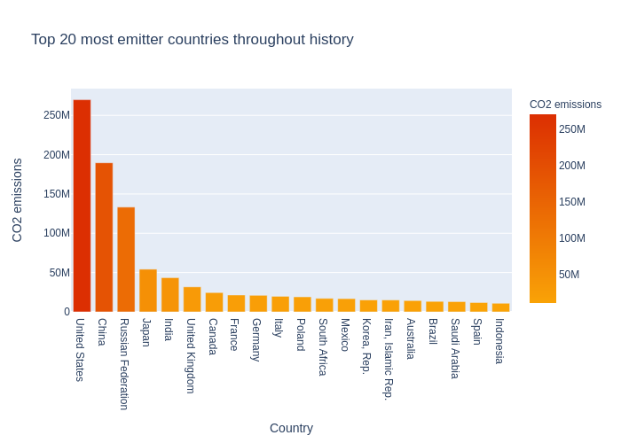

    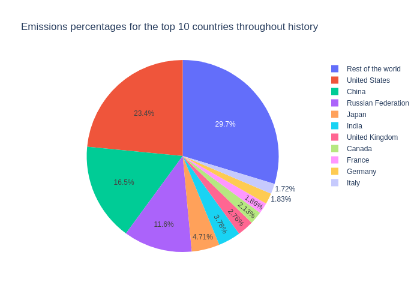

- Comparing countries today's and historical emissions:

    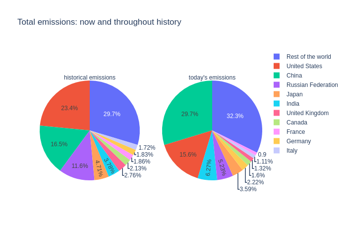

- Emissions per capita:

    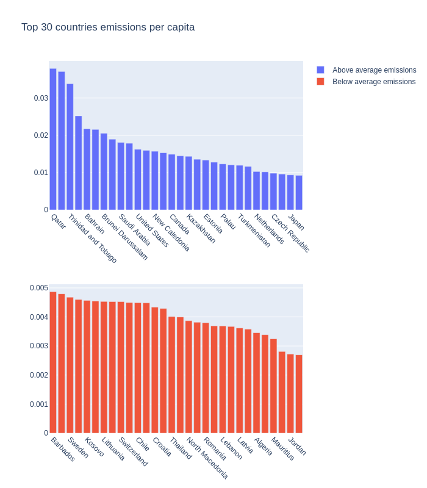

- How emissions increased through history, for each country:

    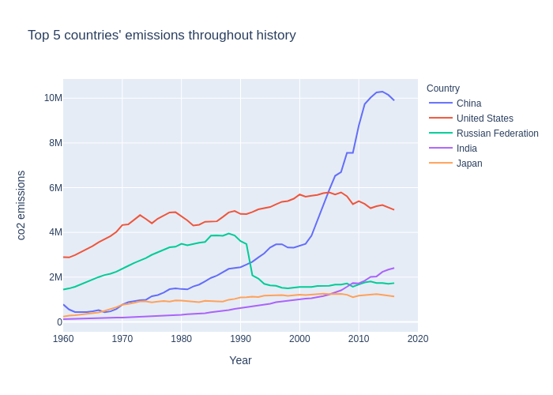

- Emissions vs GDP: the relation between emissions and GDP:

    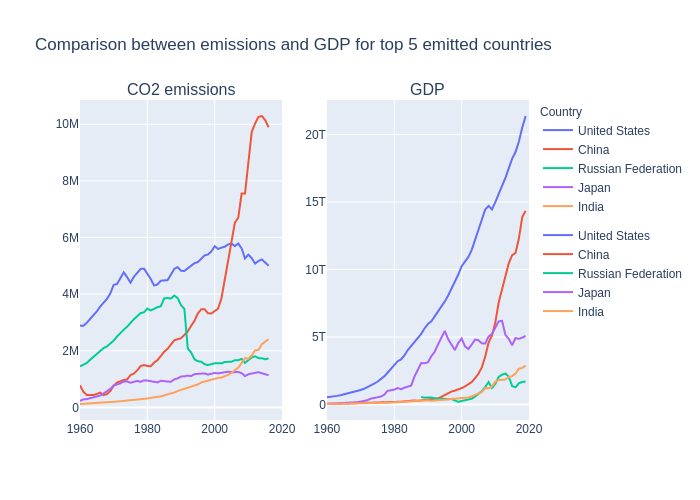
